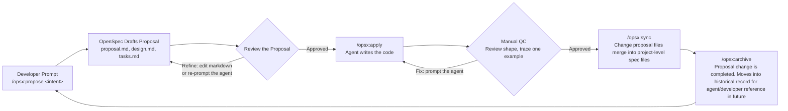

# Spec-Drive Development 
This loop shows how to employ OpenSpec in your agent driven development to properly scope out and build softwares:

```mermaid
graph LR
    A["Developer Prompt<br/>/opsx:propose &lt;intent&gt;"] --> B["OpenSpec Drafts Proposal<br/>proposal.md, design.md, tasks.md"]
    B --> C{"Review the Proposal"}
    C -- "Refine: edit markdown<br/>or re-prompt the agent" --> B
    C -- "Approved" --> D["/opsx:apply<br/>Agent writes the code"]
    D --> E{"Manual QC<br/>Review shape, trace one example"}
    E -- "Fix: prompt the agent" --> D
    E -- "Approved" --> F["/opsx:sync<br/>Change proposal files merge into project-level spec files"]
    F --> G["/opsx:archive<br/>Proposal change is completed. Moves into historical record for agent/developer reference in future"]
    G --> A

```
